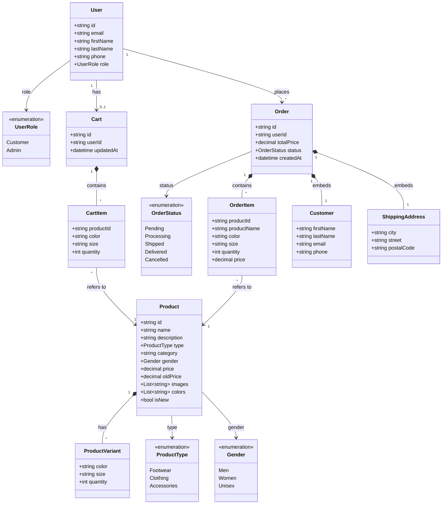
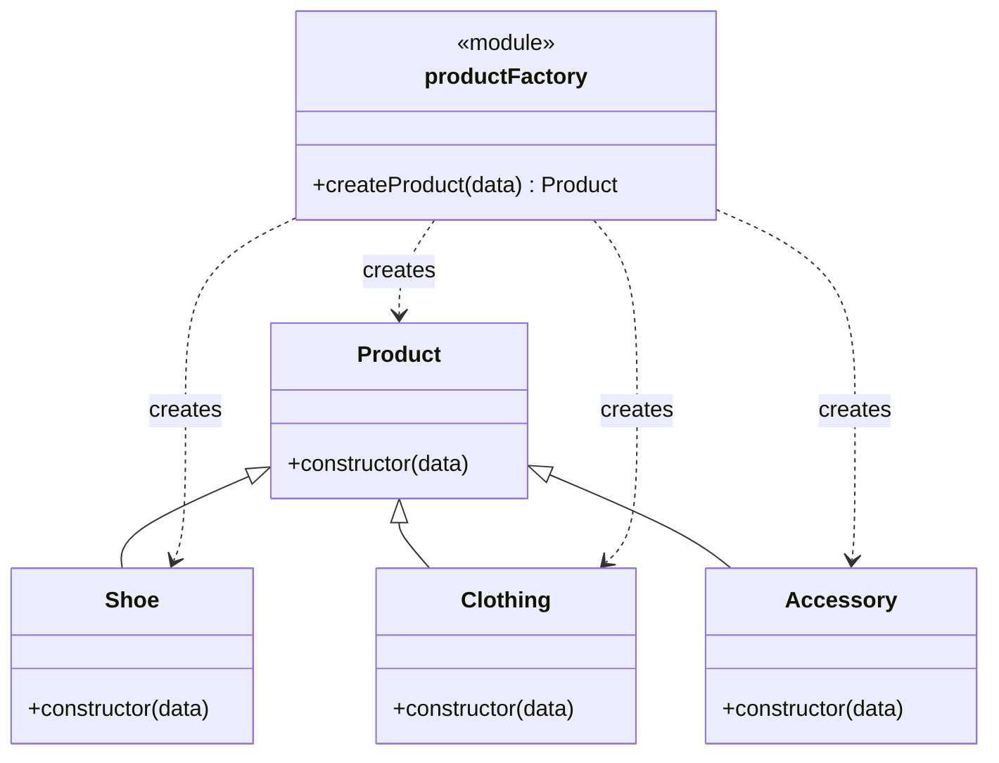

# New Balance Store — UML-діаграма класів

## 1. Domain-шар (backend)



### Опис сутностей

**User** — обліковий запис користувача. Ідентифікується через Firebase Authentication. Поле `role` визначає рівень доступу (клієнт або адміністратор).

**Cart** — кошик покупок. Належить одному `User` (зв'язок 1:0..1). Містить список `CartItem` та мітку часу останньої зміни.

**CartItem** — рядок кошика: конкретний товар (`productId`), обраний колір, розмір і кількість. Існує лише в контексті `Cart` (композиція) — окремо не зберігається.

**Order** — оформлене замовлення. Належить одному `User` (1:*, один користувач — багато замовлень). Містить суму, статус і дату створення, а також вбудовані дані покупця та адреси доставки.

**OrderItem** — рядок замовлення: товар, колір, розмір, кількість і зафіксована ціна на момент покупки (щоб зміна ціни товару в майбутньому не впливала на вже оформлені замовлення). Належить лише одному `Order` (композиція).

**Customer** — вбудований (embedded) об'єкт всередині `Order`: контактні дані покупця на момент оформлення замовлення. Не є окремою колекцією/сутністю з власним `id`.

**ShippingAddress** — вбудований об'єкт всередині `Order`: адреса доставки. Так само не є окремою сутністю.

**Product** — картка товару: назва, опис, тип, категорія, стать, ціна, зображення тощо. Один `Product` може мати багато `ProductVariant`.

**ProductVariant** — конкретна комбінація «колір + розмір» з кількістю на складі. Дозволяє зберігати один товар з великою кількістю варіацій, замість створення окремого `Product` на кожен розмір/колір.

**Enum-и:**
| Enum | Значення | Де використовується |
|---|---|---|
| `UserRole` | Customer, Admin | `User.role` |
| `ProductType` | Footwear, Clothing, Accessories | `Product.type` |
| `Gender` | Men, Women, Unisex | `Product.gender` |
| `OrderStatus` | Pending, Processing, Shipped, Delivered, Cancelled | `Order.status` |

---

## 2. Frontend Product-ієрархія (Factory Pattern)



### Опис

Це окремий, клієнтський (React/JS) шар — **не частина backend Domain**. Тут `Product` — базовий JS-клас, від якого успадковуються `Shoe`, `Clothing` та `Accessory`, кожен зі своєю специфічною поведінкою на фронтенді (наприклад, різні поля для відображення в картці товару).

**productFactory** приймає сирі дані товару (`data.type`) і повертає екземпляр потрібного підкласу — так код сторінок не повинен сам вирішувати, який клас створювати:

```
"Footwear"  → new Shoe(data)
"Clothing"  → new Clothing(data)
"Accessory" → new Accessory(data)
інше        → new Product(data)
```

---

## Загальна логіка зв'язків

```
User ──► Cart ──► CartItem ──► Product ──► ProductVariant
User ──► Order ──► OrderItem ──► Product
Order ──► Customer (embedded)
Order ──► ShippingAddress (embedded)
```